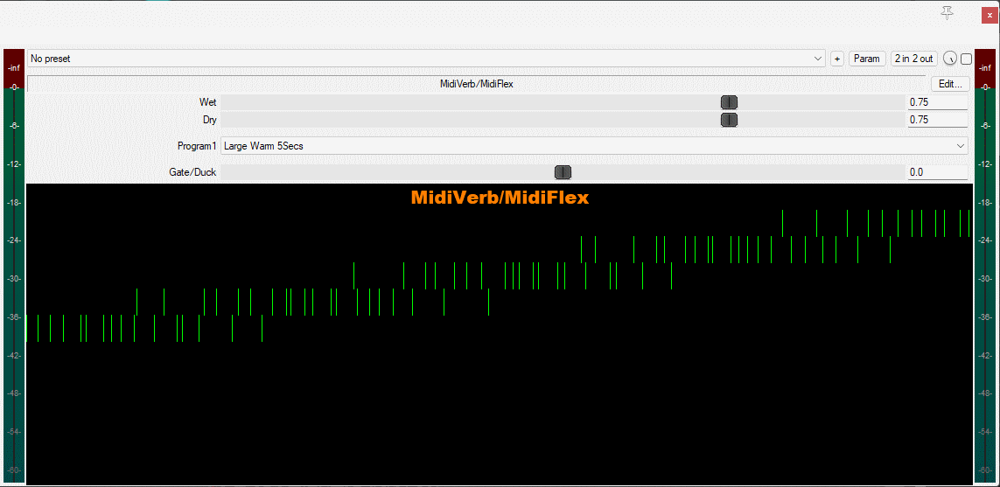

A simple reaper JS rig to analyise the various Midiverb algos.

Has the following algos, hardcoded:

-Large Bright 2.5sec
-Large Warm 5Secs
-Bright 18secs
-Dark 20Secs
-Reverse 300ms
-Reverse 600ms
-Reverb Medium Bloom (from the midiflex)

